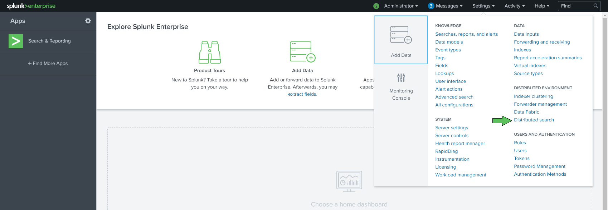
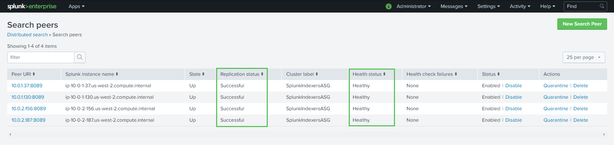
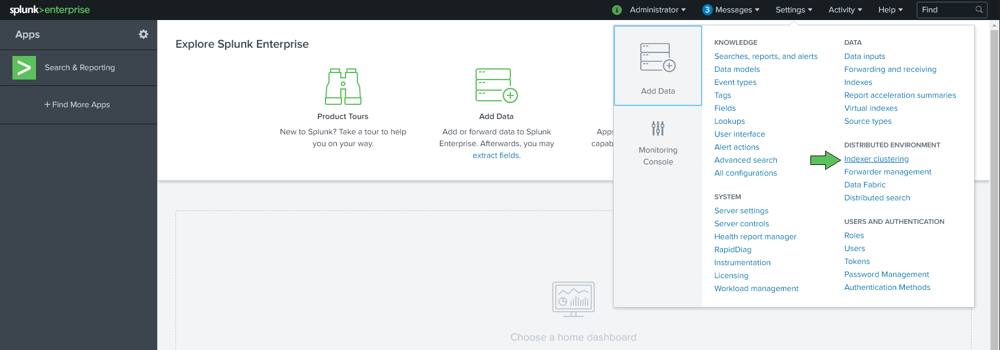
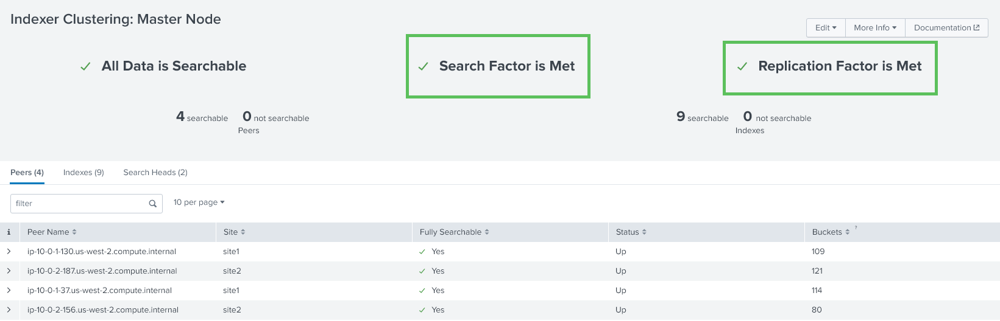

// Add steps as necessary for accessing the software, post-configuration, and testing. Don’t include full usage instructions for your software, but add links to your product documentation for that information.
//Should any sections not be applicable, remove them

== Post deployment steps
// If steps are required to test the deployment, add them here. If not, remove the heading

After the Quick Start has successfully completed, you can log into your {partner-product-name} deployment from a web browser and verify configuration.

==== Verify Distributed Search
. Begin by logging into {partner-product-name} search head to verify all of the indexers are available for search. To log into the {partner-product-name} search head, navigate your browser to the URL shown in the CloudFormation Outputs labeled "SearchHeadURL" with the credentials of "admin" and the password configured with the "SplunkAdminPassword" parameter when launching the Quick Start.
. Navigate to Settings -> 'Distributed search' menu item as shown below

[start=3]
. Click on "Search peers"

. A screen similar to the screenshot below indicates that distributed search in good standing. (This example was created with a 4 node indexer cluster.)

==== Verify Indexer Replication Status
. Begin by logging into {partner-product-name} cluster master to verify all of the indexers are successfully replicating buckets across the cluster. To log into the {partner-product-name} cluster master, navigate your browser to the URL shown in the CloudFormation Outputs labeled "ClusterMasterURL" with the credentials of "admin" and the password configured with the "SplunkAdminPassword" parameter when launching the Quick Start.
. Navigate to Settings -> 'Indexer clustering' menu item as shown below

[start=3]
. A screen similar to the screenshot below indicates that both the search factor and replication factor are in good standing. (This example was created with a 4 node indexer cluster across 2 AZ)
.. _Please note that it will likely take a few minutes after the Quick Start has successfully launched before the buckets are replicated and this status window shows both search factor and replication factor being met._

== Security
// Provide post-deployment best practices for using the technology on AWS, including considerations such as migrating data, backups, ensuring high performance, high availability, etc. Link to software documentation for detailed information.

The {partner-product-name} Quick Start exposes three user-configurable security group access parameters: 'WebClientLocation', 'HECClientLocation', and 'SSHClientLocation'. Be sure that the 'SSHClientLocation' parameter is accessible only on tightly controlled authorized network ranges as this allows direct access to the instances.  The parameter 'WebClientLocation' allows connections to the {partner-product-name} web interfaces, while 'HECClientLocation' controls access to the load balancer in front of the {partner-product-name} HTTP Event Collector listener.
