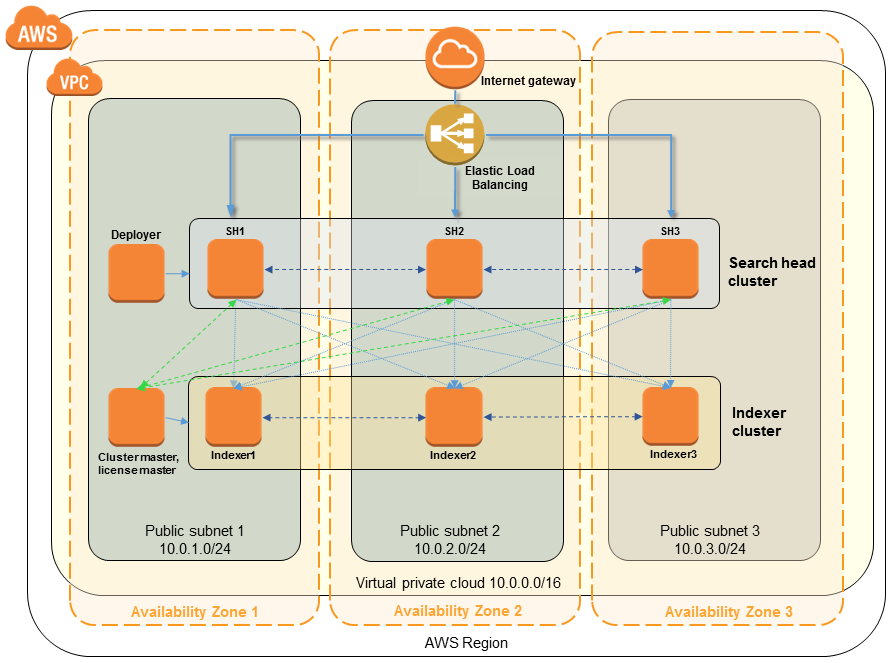

Deploying this Quick Start for a new VPC with default parameters builds the following {partner-product-name} environment in the AWS Cloud.
[#architecture1]
.Quick Start architecture for {partner-product-name} on AWS
[link=images/splunk-enterprise-architecture-on-aws.png]

As shown in figure 1, the Quick Start sets up the following:

* A VPC configured across two or three Availability Zones, depending on your selection. The Quick Start provisions one public subnet in each Availability Zone.
* Two Elastic Load Balancing (ELB) load balancers: one to load-balance HTTP web traffic to the search head instances, and the other to load-balance HTTP event traffic destined for the Splunk HTTP Event Collector (HEC) across all indexer instances.
* An IAM user with fine-grained permissions for access to AWS services necessary for the initial deployment process.
* Appropriate security groups for each instance or function to restrict access to only necessary protocols and ports.
* Amazon Simple Storage Service (Amazon S3) bucket for Splunk Smartstore usage.
* In the public subnets, EC2 instances for {partner-product-name}, including the following:
** {partner-product-name} indexer cluster with the number of indexers you specify (3-10), distributed across the number of Availability Zones you specify (2 or 3). The Splunk receiver (splunktcp) and Splunk HEC are enabled across all indexers.
** Splunk search heads, either stand-alone or in a 3-node cluster, based on your input during deployment. In the latter case, the search heads are distributed across the number of Availability Zones you specify.
** Splunk license server and indexer cluster master, co-located.
** Splunk search head deployer, where applicable.

If you decide to deploy Splunk Enterprise into your existing VPC, please see link:#_deployment_options[deployment options] later in this guide.  The Quick Start assumes that the infrastructure components already exist, and deploys Splunk Enterprise into the environment you specify.

